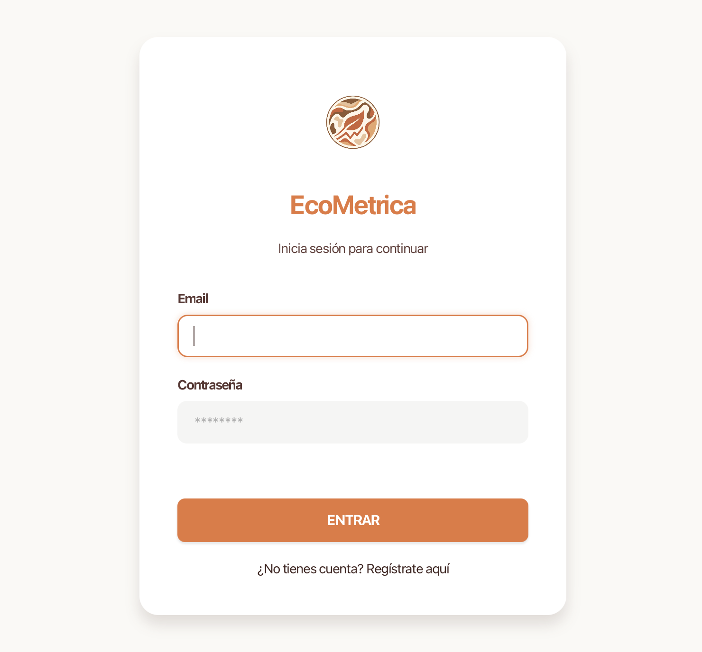
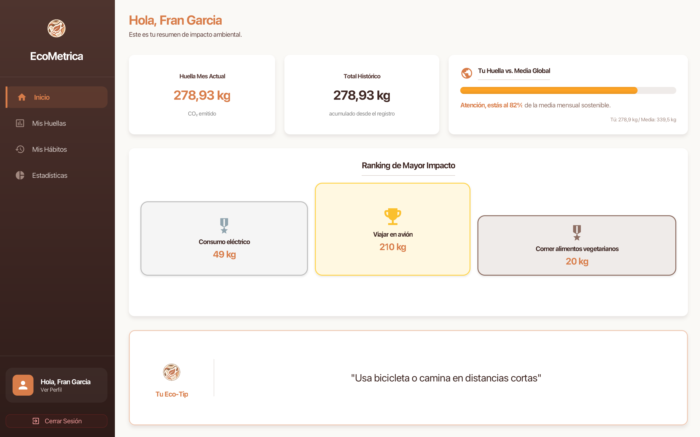
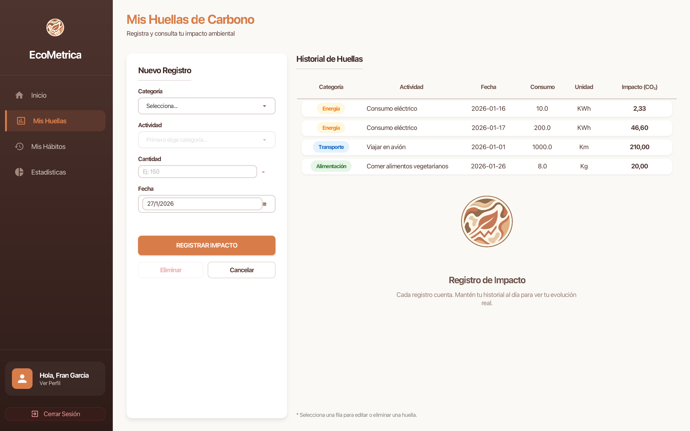
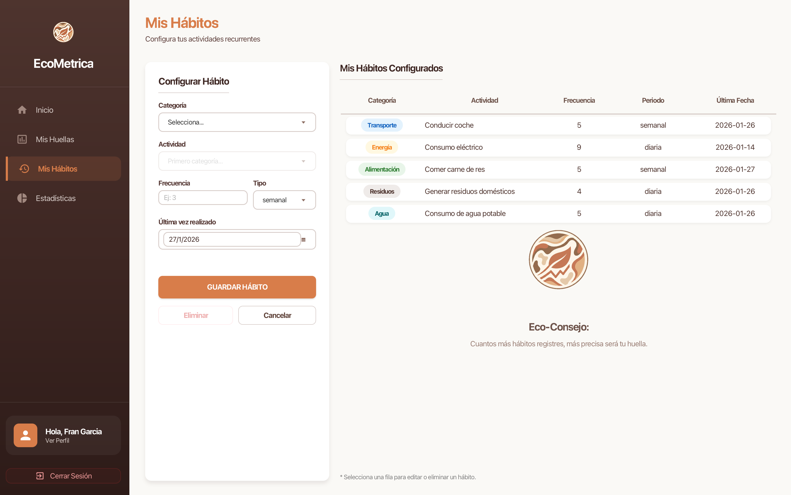
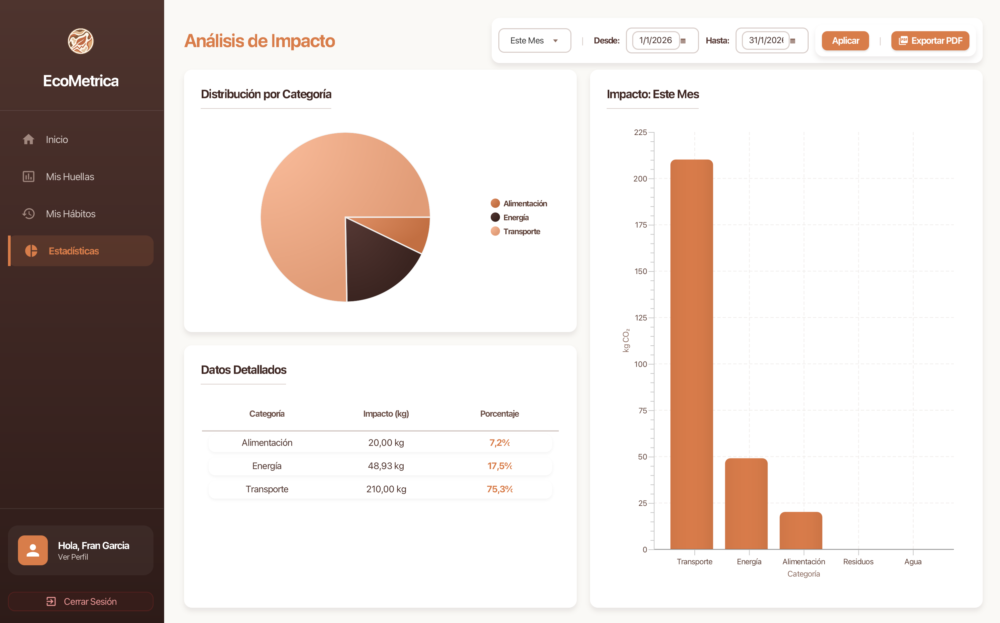
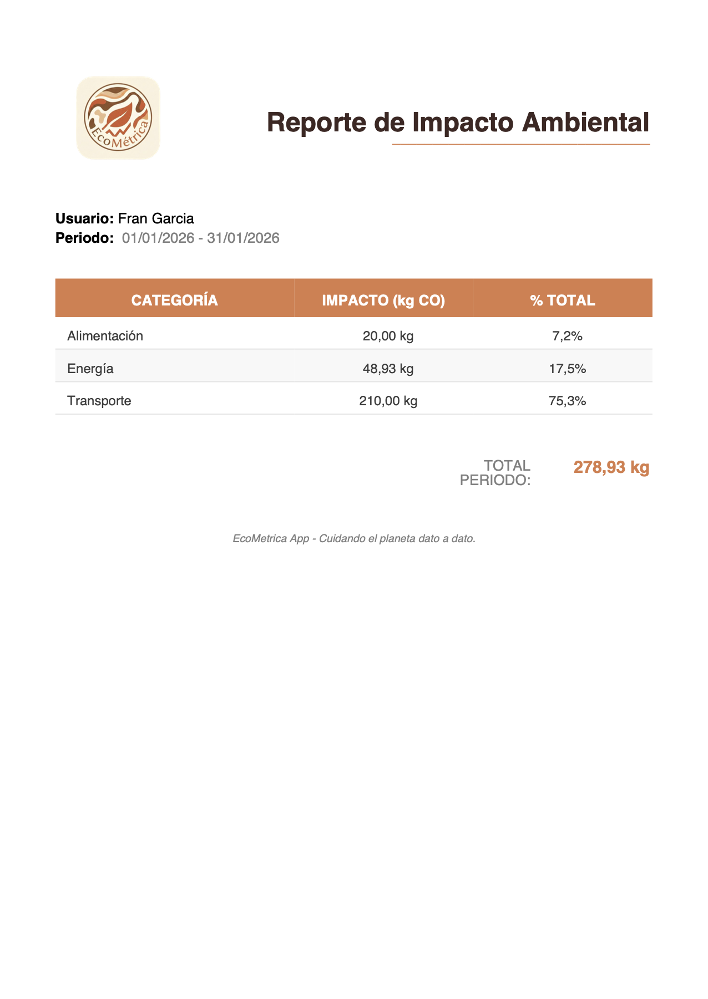

# EcoMetrica: Tu Gestor Inteligente de Huella de Carbono 🌍🌱

**EcoMetrica** es una aplicación de escritorio desarrollada en Java diseñada para transformar la conciencia ambiental en datos accionables. En un contexto donde individuos y organizaciones buscan reducir su impacto en el medio ambiente, EcoMetrica ofrece una herramienta tecnológica precisa para calcular, monitorear y optimizar la huella de carbono personal.

A diferencia de una simple calculadora, la aplicación actúa como un auditor ambiental personal, permitiendo gestionar hábitos recurrentes y visualizar el progreso a lo largo del tiempo mediante una interfaz gráfica moderna y amigable.

---

## Características Principales

* **Registro y Seguimiento (Tracking):** Registro de huellas individuales (ej: viajes, consumo eléctrico) con aplicación automática de factores de emisión estandarizados para convertirlos en kg de $CO_{2}$.
* **Gestión de Hábitos:** Administración de actividades frecuentes (diarias, semanales) para proyectar el impacto ambiental a largo plazo.
* **Inteligencia y Recomendaciones:** Motor de análisis que compara el rendimiento del usuario con la media de la comunidad y ofrece consejos personalizados.
* **Reportes Profesionales:** Generación de informes en PDF con el historial tangible de la evolución ecológica del usuario.
* **Identidad Visual "Tierra Viva":** Interfaz diseñada con una gama cromática de marrones, beiges y terracotas para evocar una conexión directa con la naturaleza.

---

## Stack Tecnológico

* **Lenguaje:** Java 23.
* **Persistencia:** Hibernate / JPA para una interacción eficiente con la base de datos.
* **Base de Datos:** MySQL.
* **Interfaz Gráfica:** JavaFX (CSS personalizado).
* **Seguridad:** JBCrypt para el cifrado seguro de contraseñas.
* **Reportes:** OpenPDF para la exportación de datos.

---

## Estructura del Modelo (JPA)

El sistema se fundamenta en 6 entidades principales mapeadas mediante Hibernate:
1.  **Usuario:** Almacena credenciales y perfil.
2.  **Actividad:** Catálogo de acciones (Conducir, Consumo eléctrico, etc.).
3.  **Categoría:** Clasificación maestra con sus factores de emisión y unidades.
4.  **Huella:** Registro de consumo específico vinculado a un usuario y actividad.
5.  **Hábito:** Gestión de la recurrencia de actividades (N:M entre Usuario y Actividad).
6.  **Recomendación:** Consejos de reducción asociados a cada categoría.

---

## Flujo de Pantallas (Guía de Interfaz)

### 1. Acceso al Sistema (Login y Registro)
Pantallas diseñadas bajo el concepto de "Card Style", enfocadas en la simplicidad y seguridad del usuario.

**- Login**


**- Registro**


---

### 2. Dashboard Principal (Inicio)
Muestra un resumen ejecutivo con los KPIs más importantes: impacto del mes, histórico y el ranking de actividades.

**- Dashboard de Inicio**


---

### 3. Gestión de Impacto (Huellas y Hábitos)
Módulos CRUD donde el usuario interactúa con sus datos. Incluyen tablas dinámicas y selectores de actividad.

**- "Mis Huellas"**


**- "Mis Hábitos"**


---

### 4. Análisis Estadístico y Reportes
Visualización avanzada mediante gráficos de tarta y barras, junto con la opción de exportar el historial.

**- Estadísticas**


**- Reporte PDF generado**


---

## ⚙️ Configuración e Instalación

1.  **Requisitos:** JDK 23, Maven y MySQL Server.
2.  **Base de Datos:** Crea el esquema `ecometrica` en tu servidor local.
3.  **Conexión:** Ajusta el usuario y contraseña en `src/main/resources/hibernate.cfg.xml`.
4.  **Ejecución:**
    ```bash
    mvn clean javafx:run
    ```
    *Nota: El sistema incluye un **DataSeeder** que carga automáticamente los datos maestros (Categorías y Actividades) en la primera ejecución.*

---

*EcoMetrica - Cuidando el planeta dato a dato.*